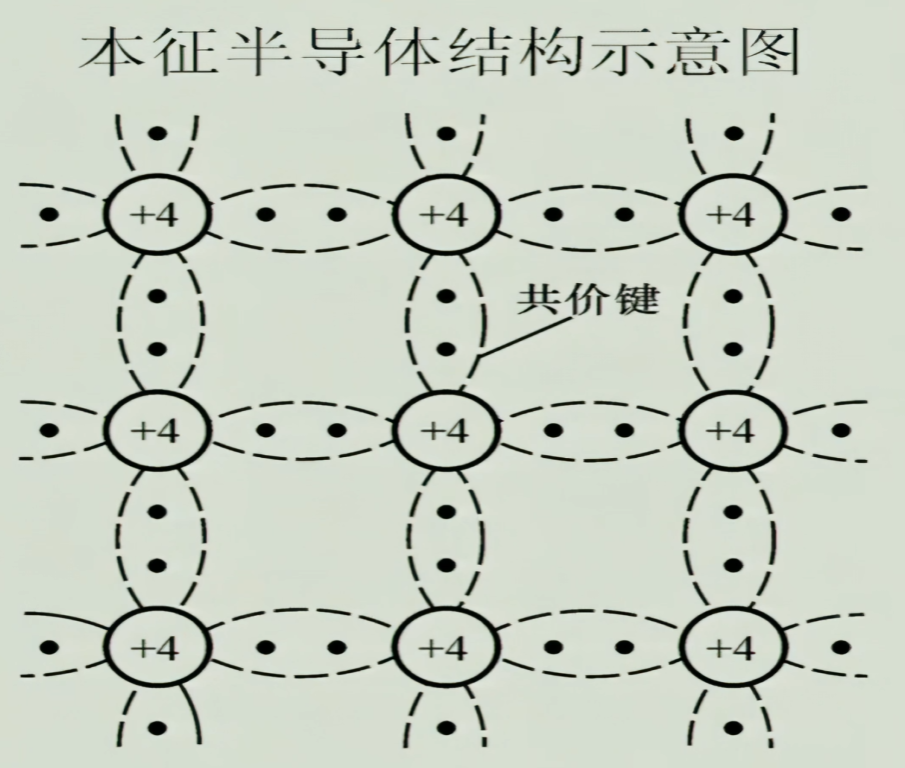
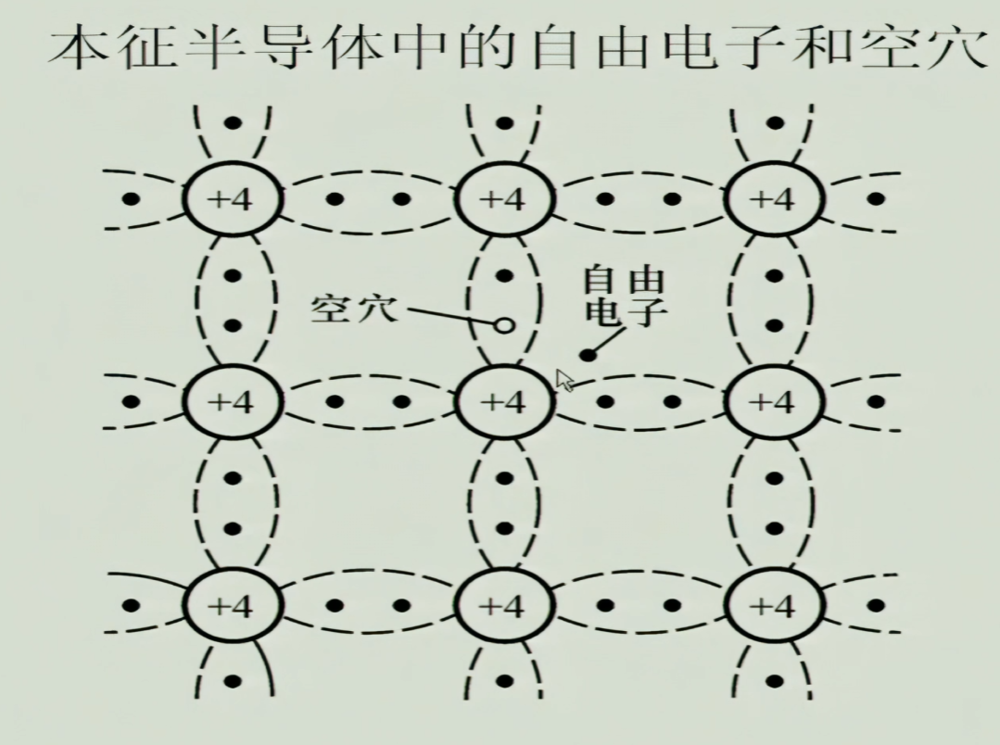

**一、什么是半导体**  
*1.概念：常温下导电性能介于导体与绝缘体之间的材料。* 
*常见的半导体材料有硅、锗、砷化镓等，而硅则是各种半导体材料应用中最具有影响力的一种。* 

*2.本征半导体：纯净的具有晶体结构的半导体成为本征半导体。* 

**二、本征半导体的晶体结构** 
 

**三、载流子** 
*1.本征激发* 
 
*2.自由电子 
3.空穴 
4.复合* 

**四、载流子的浓度**
